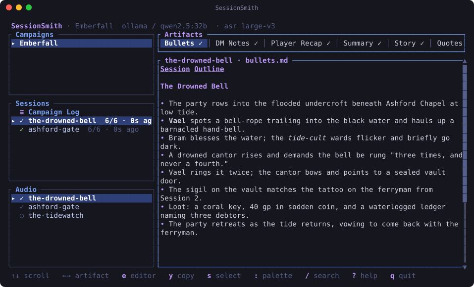
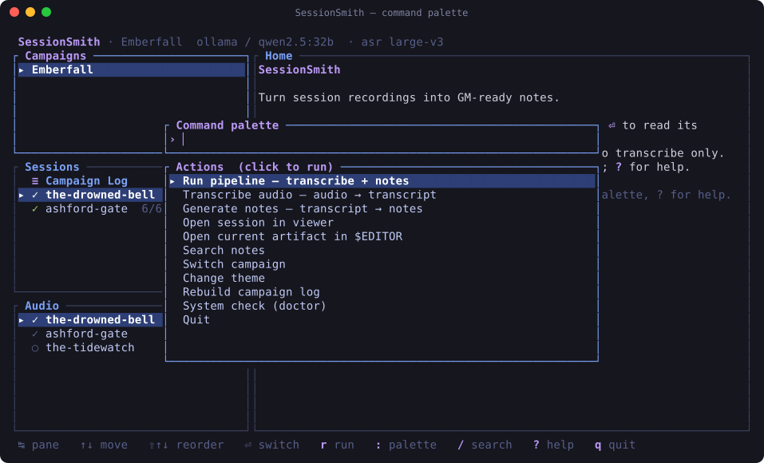
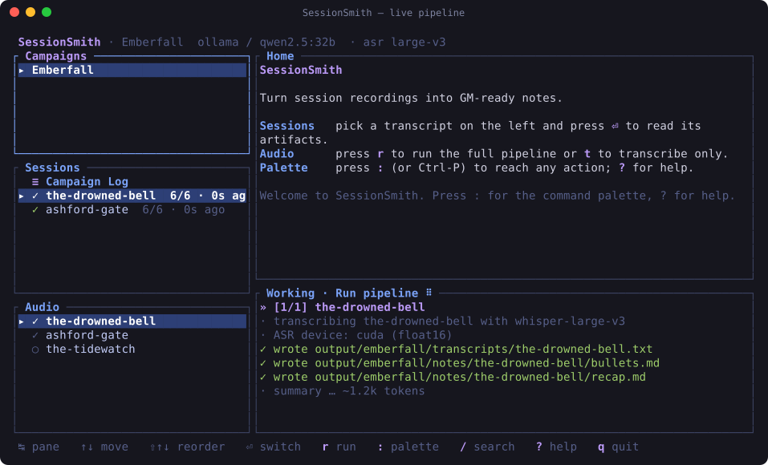
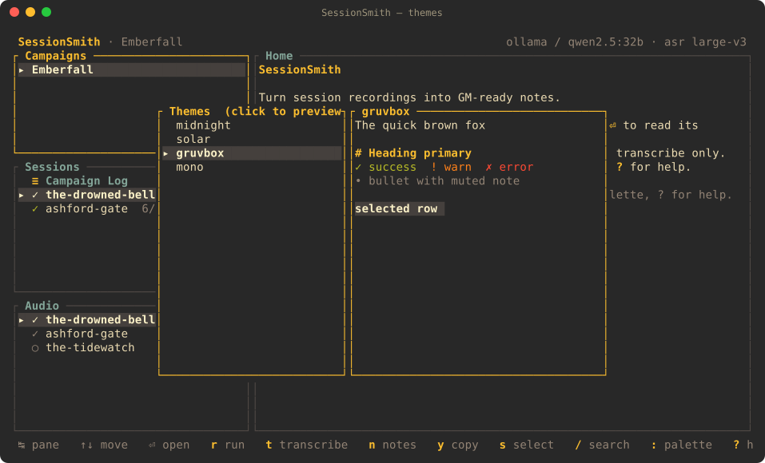

<div align="center">

# 🎤🎲 SessionSmith

**Turn raw TTRPG session recordings into GM‑ready notes — in one command, entirely on your machine.**

[](https://www.rust-lang.org)
[](#license)
[](#-design-principles)
[](docs/configuration.md)

Audio → transcript → **bullets · DM notes · recap · summary · story · quotes** → a living campaign log.

</div>

---

SessionSmith records or ingests your session audio, transcribes it with
state‑of‑the‑art speech recognition, then runs a focused multi‑pass LLM
pipeline to produce structured, system‑aware notes. Everything runs locally
by default — your recordings and notes never leave your machine unless you
deliberately point it at a cloud backend.

Drive it from a **full‑screen, mouse‑friendly terminal UI**, or script every
step from the command line for automation and CI.

```
audio/session3.wav
     │
     ▼  whisper.cpp / whisperX  (GPU‑accelerated ASR, built in)
output/<campaign>/transcripts/session3.txt
     │
     ▼  multi‑pass, system‑aware LLM pipeline
output/<campaign>/notes/session3/
  ├── bullets.md      chronological event outline (the source of truth)
  ├── dm-notes.md     where you left off · NPCs · loot · hooks · consequences
  ├── recap.md        short, spoiler‑safe player handout
  ├── summary.md      quick‑reference bullet summary
  ├── story.md        narrative chapter in prose
  └── quotes.md       memorable in‑character & table quotes

output/<campaign>/notes/_campaign-log.md   ← auto‑merged after each session
```

---

## ✨ Highlights

- 🖥️ **Full‑screen TUI** — a clickable, resizable, themeable terminal app with a
  command palette, live progress, and an in‑app markdown viewer.
- � **Manage models in‑app** — install, update and delete whisper/Ollama models
  with a live progress bar, and set defaults that are saved to your config.
- �🔒 **Local‑first** — Ollama + built‑in whisper.cpp by default. No account, no upload.
- 🎛️ **System‑aware** — bundled presets for D&D 5e, PF2e, Call of Cthulhu, Blades,
  Daggerheart & more inject the right terminology into every prompt.
- 🧵 **A living campaign log** — each session is merged into a rolling, arc‑aware log.
- 🔎 **Cross‑session search** — a per‑campaign SQLite index makes every note searchable.
- ♻️ **Resume‑safe & fail‑soft** — interrupted runs pick up where they left off;
  one failed artifact never blocks the rest.
- 🧩 **Pluggable backends** — Ollama, OpenAI‑compatible (OpenRouter/LM Studio/vLLM/Groq),
  or Anthropic.

---

## 🖥️ The interface

Launch `sessionsmith` with no arguments and you get a full‑screen dashboard.
It's fully keyboard‑driven **and** mouse‑clickable — click panes, list rows,
artifact tabs, the footer shortcuts, and every pop‑up menu.

#### Dashboard

<p align="center"></p>

#### Command palette — `:` or `Ctrl‑P`

Fuzzy‑search every action. No menu‑diving required.

<p align="center"></p>

#### Live pipeline — progress streams in place

<p align="center"></p>

#### Theme picker — live preview

Built‑in themes: **midnight**, **solar**, **gruvbox**, **mono** — plus any you
drop in `~/.config/sessionsmith/themes/*.toml`.

<p align="center"></p>

> Screenshots are generated from the real UI with
> `cargo run --example gen_screenshots`.

### Keys & mouse

| Action | Keys | Mouse |
|---|---|---|
| Move / switch pane | `↑↓` `j`/`k`, `Tab` | click a row |
| Open session / campaign log | `⏎` | click a row |
| Reorder campaigns (saved) | `Shift`+`↑↓` / `K`/`J` | — |
| Switch artifact tab | `←→` `h`/`l`, `1`–`6` | click a tab |
| Command palette | `:` / `Ctrl‑P` | click footer |
| Search notes | `/` | click footer |
| Run / transcribe / notes | `r` / `t` / `n` | click footer |
| Manage models (install/delete/default) | `m` | palette |
| Copy current view (OSC 52) | `y` | click **copy** |
| Select mode (native drag‑select) | `s` | click **select** |
| Open in `$EDITOR` | `e` | — |
| Change theme · Help · Quit | `T` · `?` · `q` | click footer |

Prefer the classic line‑based prompts? Run `sessionsmith --no-tui`
(or set `[ui] legacy_menu = true`).

---

## 🚀 Getting started

```bash
# Build (requires Rust 1.75+ and cmake + clang/libclang for the bundled ASR engine)
cargo build --release

# First‑run wizard — detects your GPU, recommends models, scaffolds your campaign
./target/release/sessionsmith init

# Drop audio files in audio/ then launch the TUI
./target/release/sessionsmith
```

For GPU‑accelerated transcription, build with a backend feature:

```bash
cargo build --release --features cuda    # or: vulkan / metal
```

See [docs/setup.md](docs/setup.md) for detailed installation and hardware guidance,
then run `sessionsmith doctor` to verify everything.

---

## ⚙️ How it works

1. **Transcription** — whisper.cpp (built in via `whisper-rs`) or whisperX converts
   audio to text, using CUDA/Vulkan/Metal when available and falling back to CPU.
2. **Bullet extraction** — the full transcript is turned into a dense, chronological
   event outline with a system‑aware prompt. This becomes the source of truth.
3. **Derived artifacts** — DM notes, recap, summary, story and quotes are each
   generated *from the bullets* in a focused, context‑efficient pass.
4. **Campaign‑log merge** — the new summary is merged into a rolling campaign log,
   producing a living document that tracks your whole arc.

Each campaign lives in its own directory under `output/`, so games never
cross‑contaminate.

---

## 🧭 Commands

| Command | Purpose |
|---|---|
| `sessionsmith` | Launch the full‑screen TUI (add `--no-tui` for the classic menu) |
| `sessionsmith run [files…] [--all]` | Full pipeline: audio → transcript → notes |
| `sessionsmith transcribe [files…]` | Transcribe only |
| `sessionsmith notes [transcript]` | Generate notes from an existing transcript |
| `sessionsmith record [name]` | Capture live audio into `audio/` (via ffmpeg) |
| `sessionsmith search <query>` | Search indexed session notes |
| `sessionsmith log show \| rebuild` | View or regenerate the campaign log |
| `sessionsmith models` | List, pull, and configure ASR/LLM models |
| `sessionsmith systems list \| show <name>` | Browse game‑system presets |
| `sessionsmith doctor` | Health check: deps, hardware, backend connectivity |
| `sessionsmith init` | First‑run setup wizard |

Run any command with `--help` for the full flag reference.

---

## 🔧 Configuration

Two config files:

- **Campaign config** (`campaigns/<name>.toml`) — campaign name, players, game
  system, and which artifacts to generate. One per campaign.
- **Global config** (`~/.config/sessionsmith/config.toml`) — backend, model, ASR
  and runtime options, plus UI preferences. Shared across all campaigns.

```toml
[backend]
kind  = "ollama"                 # ollama | openai | anthropic
model = "qwen3.5:27b"

[asr]
model = "large-v3-turbo"

[ui]
theme       = "midnight"         # midnight | solar | gruvbox | mono | <your theme>
legacy_menu = false              # true → classic line‑based menu instead of the TUI
```

See [docs/configuration.md](docs/configuration.md) for the full reference,
including OpenAI/OpenRouter/Anthropic setups and per‑campaign options.

---

## 🎯 Game‑system presets

Presets teach the LLM what terminology, mechanics, and structure matter for your
game — no manual prompt engineering.

| Preset | System |
|---|---|
| `dnd5e` | Dungeons & Dragons 5th Edition |
| `pf2e` | Pathfinder 2nd Edition |
| `coc` | Call of Cthulhu |
| `blades` | Blades in the Dark |
| `daggerheart` | Daggerheart |
| `generic` | System‑agnostic (any RPG) |
| `wordsmith` | Wordsmith (narrative dice) |

A custom preset is a single TOML file — see [docs/presets.md](docs/presets.md).

---

## 📦 Requirements

| Dependency | Role |
|---|---|
| Rust 1.75+ | Build the binary |
| C toolchain + `cmake` + `clang`/`libclang` | Build‑time only: compiles the bundled whisper.cpp engine |
| `ffmpeg` + `ffprobe` | Audio decoding & duration detection |
| An LLM backend | Ollama (local), OpenAI‑compatible, or Anthropic |

Speech‑to‑text is **built in** (whisper.cpp via `whisper-rs`) — no external ASR
tool is needed at runtime. `whisperX` is only required for speaker diarization.
Build with `--features cuda` (or `vulkan`/`metal`) for GPU acceleration; see
[docs/setup.md](docs/setup.md). Run `sessionsmith doctor` to verify your setup.

---

## 📚 Documentation

| Document | Contents |
|---|---|
| [docs/setup.md](docs/setup.md) | Installation, hardware guidance, first run |
| [docs/configuration.md](docs/configuration.md) | Full config file reference |
| [docs/presets.md](docs/presets.md) | Writing and customizing game‑system presets |
| [docs/pipeline.md](docs/pipeline.md) | Architecture, artifact pipeline, prompt design |

---

## 🤝 Contributing

```bash
cargo test --lib    # unit tests
cargo build         # debug build for iteration
make all            # release build + run
```

To add a game system, drop a TOML in `presets/` following the pattern in
[docs/presets.md](docs/presets.md) and register it in
[src/presets.rs](src/presets.rs).

---

## 🧱 Design principles

- **Local‑first.** Ollama is the default backend; recordings and notes stay on
  your machine unless you choose a cloud backend.
- **Resume‑safe.** `--resume` skips any artifact whose output already exists.
- **Campaign‑isolated.** Each campaign gets its own output directory.
- **System‑aware.** Presets inject game‑specific terminology and structure into
  every prompt.
- **Fail‑soft.** If one artifact fails, the others still complete; the campaign‑log
  merge is non‑fatal and can be rebuilt.

---

## License

Released under the [MIT License](LICENSE).
