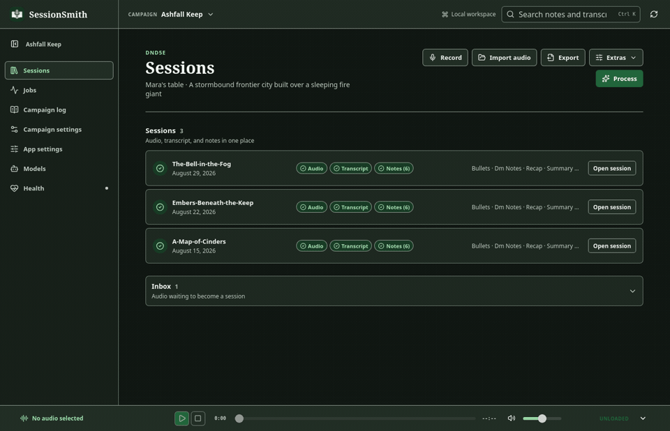
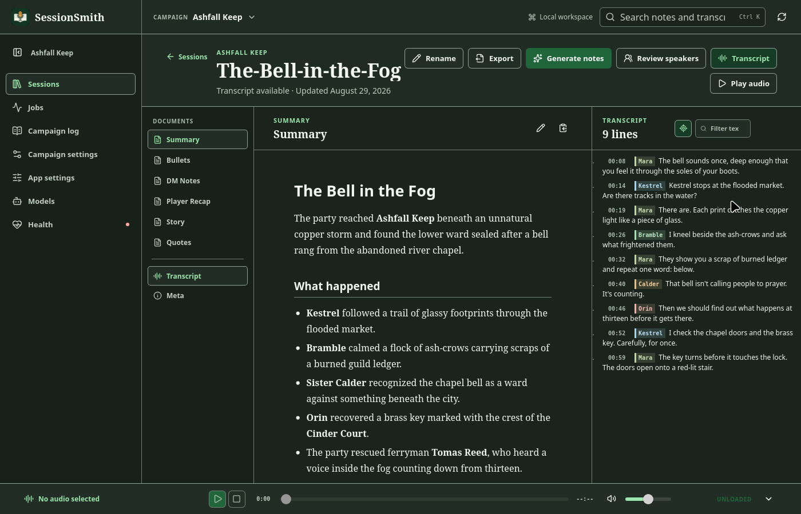
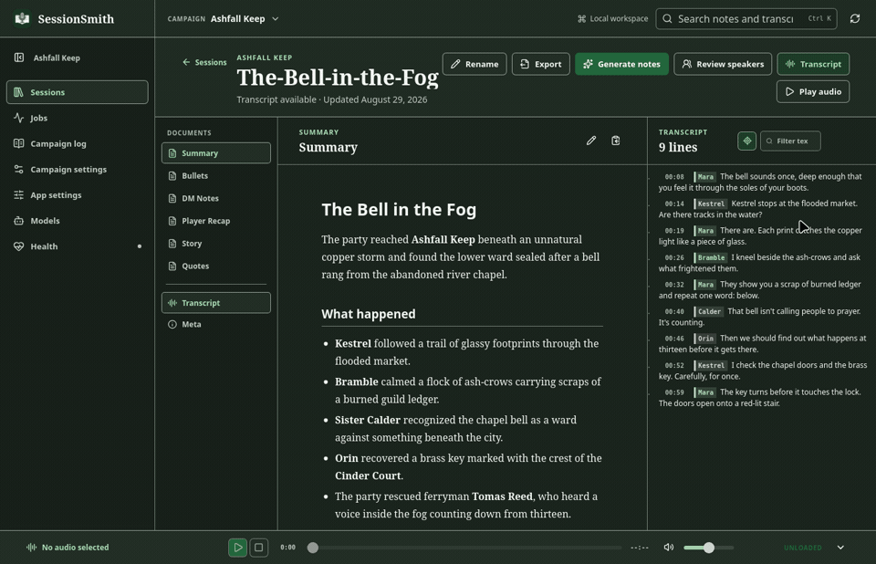
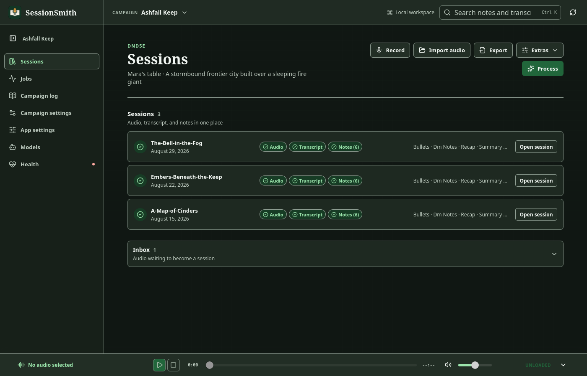
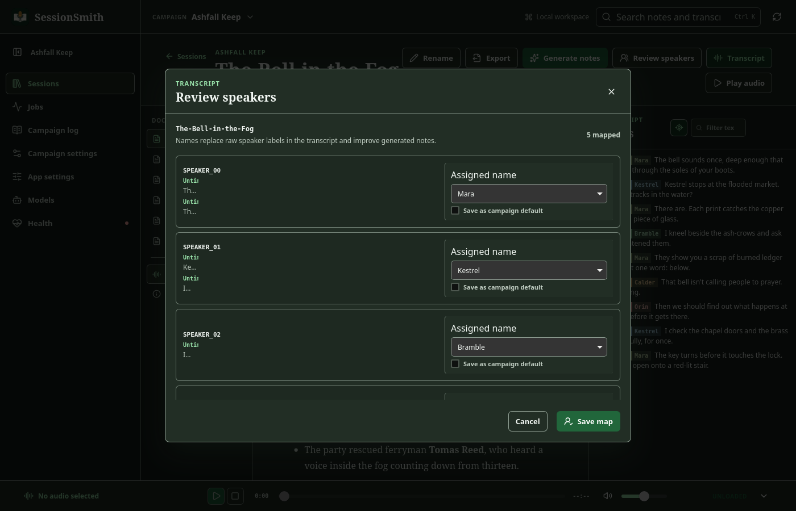
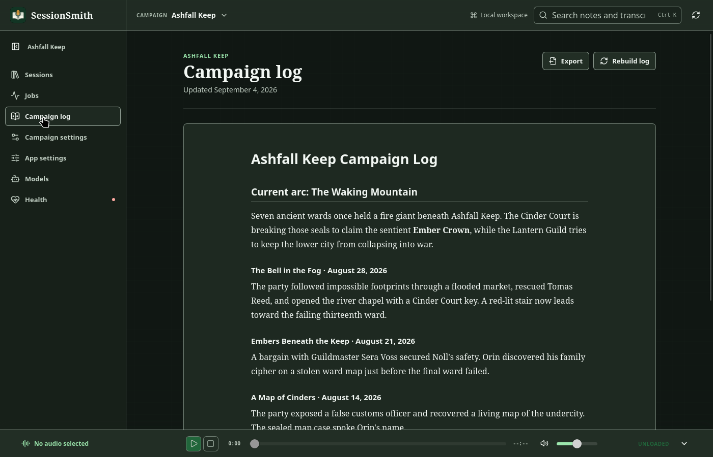
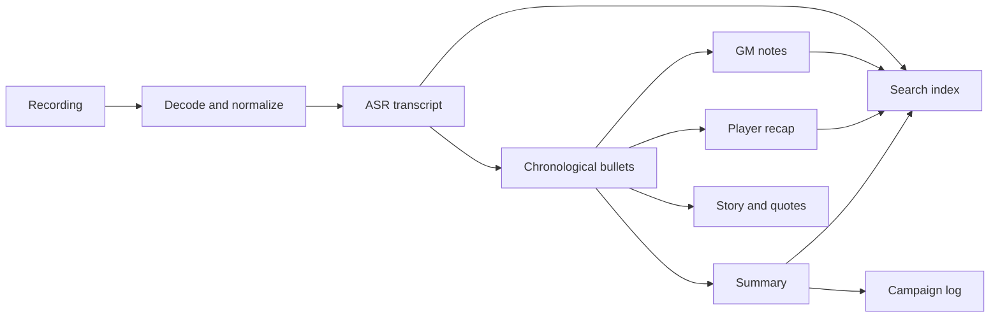

<div align="center">


# SessionSmith

### Turn table audio into campaign memory.

SessionSmith is a local-first desktop workbench for tabletop RPG recordings. It turns a session into a searchable transcript, useful GM notes, a player recap, and a living campaign log without giving up control of your files.

[Download the latest release](https://github.com/Kardzhilov/SessionSmith/releases/latest) · [Setup guide](docs/setup.md) · [Configuration](docs/configuration.md) · [How the pipeline works](docs/pipeline.md)

[](https://github.com/Kardzhilov/SessionSmith/releases/latest)
[](https://github.com/Kardzhilov/SessionSmith/actions/workflows/ci.yml)
[](#quick-start)
[](#local-first-by-design)
[](LICENSE)

</div>

<p align="center">
  
</p>

## One recording, everything you need next week

A long transcript is not campaign prep. SessionSmith keeps the source audio, transcript, generated documents, edits, speaker names, and campaign history together so you can move from “what happened?” to “what happens next?” in one workspace.

1. **Record or import** a session in WAV, MP3, M4A, FLAC, OGG, Opus, AAC, WMA, or WebM.
2. **Transcribe locally** with built-in whisper.cpp or choose another supported ASR engine.
3. **Review the evidence** with timestamps, audio seeking, transcript filtering, and speaker mapping.
4. **Generate focused documents** from one chronological source of truth.
5. **Search and carry context forward** through a rolling, arc-aware campaign log.

<p align="center">
  
</p>

## Notes with distinct jobs

SessionSmith does not ask one giant prompt to produce one giant blob. It first extracts a dense chronological outline, then gives every derived document its own focused pass.

| Document | What it is for |
|---|---|
| **Bullets** | Chronological event outline and source of truth for every other document |
| **GM notes** | Where you stopped, NPC state, loot, hooks, consequences, and next-session pressure |
| **Player recap** | Short, spoiler-safe handout to open the next session |
| **Summary** | Fast reference for names, places, decisions, and unresolved threads |
| **Story** | The session reshaped into readable narrative prose |
| **Quotes** | Memorable in-character and table moments |

Every document remains Markdown on disk. Edit it in the app, compare a candidate regeneration before replacing the current version, or open it with any editor you already use.

## A campaign, not a pile of files

<p align="center">
  
</p>

- **Campaign library** keeps completed sessions and unprocessed Inbox audio together.
- **Living campaign log** merges session summaries into an ongoing record of arcs and open threads.
- **Cross-session search** finds names, locations, quotes, and plot hooks in notes and transcripts.
- **Speaker review** maps diarized labels to players, characters, and recurring voices.
- **Candidate notes** let you compare or preserve alternate generations without touching the current notes.
- **Offline exports** produce a self-contained HTML archive or an Obsidian-ready folder tree.
- **Jobs center** shows phase, progress, logs, failures, and cancellation for long-running work.
- **Model catalog and health checks** keep local ASR and Ollama setup visible inside the app.

<details>
<summary><strong>See the library, speaker review, and campaign log</strong></summary>

<br>

<p align="center"></p>

<p align="center"></p>

<p align="center"></p>

</details>

## Local-first by design

Your campaign workspace is a normal directory on your machine. Local Whisper handles transcription in-process, and Ollama can generate notes without sending recordings or transcripts to a hosted service.

| Stage | Fully local default | Optional alternatives |
|---|---|---|
| Speech recognition | whisper.cpp through `whisper-rs` | WhisperX, faster-whisper, Parakeet, Canary, Voxtral, Cohere Transcribe |
| Note generation | Ollama | OpenAI, Anthropic, OpenRouter, LM Studio, vLLM, Groq, or another OpenAI-compatible endpoint |
| Storage | Markdown, JSON, TOML, audio, and a local SQLite search index | Offline HTML and Obsidian exports |

Cloud backends are explicit configuration choices. When you select one, the text required for that request is sent to that provider and is subject to its privacy and retention policy. SessionSmith never silently chooses a hosted backend.

## Quick start

### Install the desktop app

Download the current installer or portable bundle for Linux, macOS, or Windows from [GitHub Releases](https://github.com/Kardzhilov/SessionSmith/releases/latest). The first-run setup walks through system health, models, backend selection, and campaign creation.

At runtime, SessionSmith needs:

- `ffmpeg` and `ffprobe` for audio decoding and inspection.
- An LLM backend: Ollama for local generation, or a configured hosted/compatible endpoint.
- WhisperX only when you want its speaker diarization workflow. Local transcription is built in.

Full local workflow support is established on Linux and macOS. Windows desktop bundles are built in CI; local audio and GPU tooling still depend on what is installed on the target machine.

### Build the desktop app from source

You need the current stable Rust toolchain, Node.js, npm, and the platform prerequisites listed in the [setup guide](docs/setup.md).

```bash
git clone https://github.com/Kardzhilov/SessionSmith.git
cd SessionSmith
make app
```

`make app` installs the locked frontend dependencies when needed and launches Tauri in development mode.

### Use the CLI

The same pipeline is available for scripts, automation, and terminal workflows:

```bash
# Build the optimized CLI with local whisper.cpp support
cargo build --release

# Detect hardware, configure models, and create a campaign
./target/release/sessionsmith init

# Run audio -> transcript -> notes
./target/release/sessionsmith run audio/session-12.wav
```

Build with a GPU backend when the matching SDK and drivers are installed:

```bash
cargo build --release --features cuda     # NVIDIA
cargo build --release --features vulkan   # AMD, Intel, or NVIDIA
cargo build --release --features metal    # Apple Silicon
```

## How it works



The pipeline is designed to be inspectable and recoverable:

- **Resume-safe:** existing outputs can be skipped after an interrupted run.
- **Fail-soft:** one failed document does not block the rest of the session.
- **Campaign-isolated:** each campaign gets separate config, transcripts, notes, and index data.
- **Reviewable:** transcript, prompts, Markdown outputs, candidates, and job logs remain accessible.
- **System-aware:** presets inject game-specific language and structure into every pass.

Read [docs/pipeline.md](docs/pipeline.md) for the architecture, prompt strategy, chunking, and campaign-log merge behavior.

## Game-system presets

Presets teach the pipeline which terminology, mechanics, and details matter to your table.

| Preset | System |
|---|---|
| `dnd5e` | Dungeons & Dragons 5th Edition |
| `pf2e` | Pathfinder 2nd Edition |
| `coc` | Call of Cthulhu |
| `blades` | Blades in the Dark |
| `daggerheart` | Daggerheart |
| `wordsmith` | Wordsmith narrative dice |
| `generic` | System-agnostic tabletop RPGs |

Presets are plain TOML. Start with [docs/presets.md](docs/presets.md) to add terminology, campaign-specific instructions, or a new system.

## Configuration

SessionSmith separates machine-wide defaults from campaign context:

- `~/.config/sessionsmith/config.toml` stores backend, model, ASR, path, and desktop preferences.
- `campaigns/<name>.toml` stores the campaign, players, system, vocabulary, outputs, and per-campaign overrides.

```toml
[backend]
kind = "ollama"
model = "qwen3.5:27b"

[asr]
model = "large-v3-turbo"
diarize = false

[desktop]
appearance = "system"
date_format = "dmy"
```

See [docs/configuration.md](docs/configuration.md) for every option, including OpenAI-compatible and Anthropic backends, path overrides, structured output, VAD, model selection, and custom prompts.

## Files stay portable

```text
audio/
  the-bell-in-the-fog.wav
campaigns/
  ashfall-keep.toml
output/ashfall-keep/
  transcripts/
    the-bell-in-the-fog.txt
    the-bell-in-the-fog.srt
    the-bell-in-the-fog.ssmeta.json
  notes/
    the-bell-in-the-fog/
      bullets.md
      dm-notes.md
      recap.md
      summary.md
      story.md
      quotes.md
    _campaign-log.md
```

There is no proprietary campaign format to escape later. Your recordings remain audio files, your notes remain Markdown, and your configuration remains TOML.

## CLI reference

| Command | Purpose |
|---|---|
| `sessionsmith run [files...] [--all]` | Run transcription and note generation |
| `sessionsmith transcribe [files...]` | Transcribe without generating notes |
| `sessionsmith notes [transcript]` | Generate notes from an existing transcript |
| `sessionsmith record [name]` | Record through ffmpeg into the audio directory |
| `sessionsmith search <query>` | Search the selected campaign |
| `sessionsmith search --all <query>` | Search across campaign indexes |
| `sessionsmith log show \| rebuild` | View or regenerate the campaign log |
| `sessionsmith models` | Inspect, install, remove, and configure models |
| `sessionsmith export <stem> --format html\|obsidian` | Create a portable export |
| `sessionsmith systems list \| show <name>` | Browse bundled presets |
| `sessionsmith doctor` | Check dependencies, hardware, models, and backend connectivity |
| `sessionsmith init` | Run first-time setup |

Run any command with `--help` for all options. Launching `sessionsmith` without a subcommand opens the terminal interface; pass `--no-tui` for the classic line-based flow.

## Development

```bash
make app                                      # desktop app with hot reload
make browser                                  # frontend in a browser
make binary                                   # optimized CLI only
cargo test --lib                              # Rust unit tests
npm --prefix apps/desktop run check:ci        # desktop tests, bindings, and build
```

The desktop app is Tauri 2, React 19, and TypeScript. The core pipeline is Rust and is shared with the CLI. Generated TypeScript bindings keep the Tauri command contract checked in CI.

Contributions should stay focused, include tests proportional to the change, and preserve the local-first defaults. To add a system, place a TOML preset in `presets/`, register it in [src/presets.rs](src/presets.rs), and document it in [docs/presets.md](docs/presets.md).

<details>
<summary><strong>Release maintainers</strong></summary>

Pushes to `main` create a release only when a commit message contains a standalone, case-sensitive `PATCH`, `MINOR`, or `MAJOR` marker. The highest marker wins. The workflow synchronizes Cargo and npm versions, builds signed Tauri bundles for all three platforms, publishes updater metadata, and releases only after every platform entry is present.

The updater requires `TAURI_SIGNING_PRIVATE_KEY` and `TAURI_SIGNING_PRIVATE_KEY_PASSWORD`. Keep an encrypted backup of both: existing installations trust the embedded public key and cannot accept future updates signed by a replacement key.

</details>

## Documentation

- [Setup and hardware](docs/setup.md)
- [Configuration reference](docs/configuration.md)
- [Pipeline architecture](docs/pipeline.md)
- [Game-system presets](docs/presets.md)
- [Desktop product site](https://kardzhilov.github.io/SessionSmith/)

## License

SessionSmith is released under the [MIT License](LICENSE).
