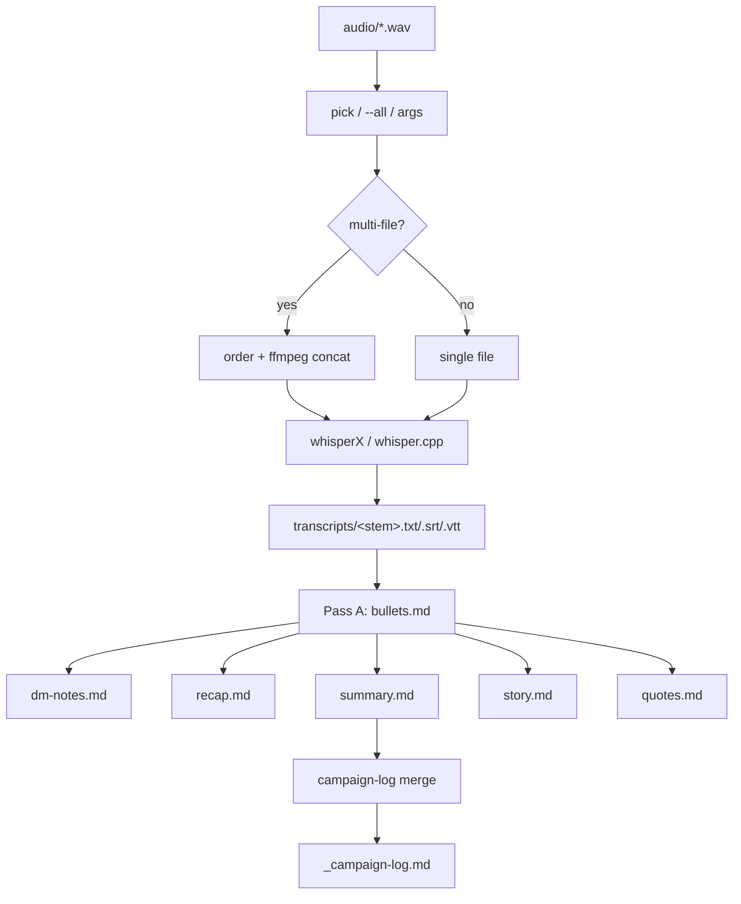

# SessionSmith — In-Depth Technical Report

> A complete walkthrough of what SessionSmith is, how it is structured, and how
> every moving part works together. This document describes the repository as it
> exists in the root and `src/` tree today.

---

## 1. What SessionSmith is

SessionSmith is a **local-first command-line tool** that turns raw tabletop
RPG (TTRPG) session recordings into a set of GM-ready written artifacts. The
end-to-end flow is:

```
audio file(s)  ──►  transcript  ──►  multi-pass LLM pipeline  ──►  notes + campaign log
```

It is written entirely in **Rust** (edition 2021), ships as a single
self-contained binary (`sessionsmith`), and is designed to run offline: the
default LLM backend is a local [Ollama](https://ollama.com) server and the
default ASR (speech-to-text) engine is either `whisper.cpp` or `whisperX`.

The core philosophy, stated in the README's design principles:

- **Local-first** — recordings and notes never leave the machine unless a cloud
  backend is explicitly chosen.
- **Resume-safe** — `--resume` skips artifacts whose output already exists.
- **Campaign-isolated** — each campaign gets its own output directory.
- **System-aware** — game-system *presets* inject terminology and capture
  priorities into every prompt.
- **Fail-soft** — one failed artifact never blocks the others; the campaign-log
  merge is non-fatal.

---

## 2. Repository layout (root)

| Path | Role |
|---|---|
| `Cargo.toml` | Crate manifest, dependencies, release profile. |
| `Makefile` | User-facing launcher; builds release binary on demand and dispatches subcommands. |
| `README.md` | Product-level documentation and quick start. |
| `src/` | All Rust source. Contains its own developer `Makefile`. |
| `presets/` | Bundled game-system TOML presets (embedded at compile time). |
| `campaigns/` | Per-campaign config files (`<name>.toml`). |
| `output/` | Generated artifacts, isolated per campaign slug. |
| `audio/` | Drop zone for input recordings (created on demand). |
| `docs/` | Long-form docs: setup, configuration, presets, pipeline. |
| `target/` | Cargo build output (debug + release). |

### 2.1 `Cargo.toml` highlights

- **CLI/UX:** `clap` (derive + env), `inquire` (interactive prompts),
  `indicatif` (spinners/progress), `comfy-table`, `owo-colors`.
- **Async + HTTP:** `tokio` (full), `reqwest` (rustls-tls, streaming, json),
  `tokio-stream`, `futures-util`, `eventsource-stream` (SSE), `async-trait`.
- **Serialization/config:** `serde`, `serde_json`, `toml`.
- **System/utility:** `sysinfo` (hardware detect), `dirs` (XDG paths),
  `walkdir`, `humantime`, `time`, `regex`, `sha2`+`hex` (model checksums),
  `ctrlc`, `once_cell`, `tracing`(+subscriber).
- **Error handling:** `anyhow` (application errors) + `thiserror`.
- **Dev/test:** `tempfile`, `wiremock` (HTTP mocking).
- **Release profile:** `lto = "thin"`, `codegen-units = 1`, `strip = true`
  for a lean, fast binary.

### 2.2 The two Makefiles

- Root `Makefile` is a **launcher**: it rebuilds `target/release/sessionsmith`
  only when sources are newer, then runs subcommands (`run`, `init`,
  `transcribe`, `notes`, `log`, `doctor`, `systems`, `models`). It delegates
  developer targets to `src/Makefile` via `make dev TARGET=<target>`.
- `src/Makefile` holds the developer targets (build, test, fmt, clippy, etc.).

---

## 3. Source architecture (`src/`)

`lib.rs` exposes the crate's modules; `main.rs` is a thin binary entrypoint.

```
main.rs        Binary entry: logging, Ctrl-C handler, CLI dispatch.
lib.rs         Library root: re-exports modules; Result<T> alias.
cli.rs         clap definitions for every command and its args.
config.rs      Global + campaign config structs, load/save, env expansion.
hardware.rs    Hardware detection + model recommendation tiers.
deps.rs        Dependency/health checks (ffmpeg, ASR, model, backend).
models.rs      Whisper ggml downloads + Ollama pull + size lookups.
audio.rs       Audio file scanner + ffprobe duration + humanizers.
session.rs     Turns selected files into ordered "sessions" (concat/AI-sort).
transcribe.rs  ASR engine resolution + whisper.cpp/whisperX execution.
prompts.rs     Artifact enum + prompt templates + prompt composition.
pipeline.rs    Orchestrates LLM passes + campaign-log merge.
presets.rs     Bundled game-system presets (embedded TOML).
ui.rs          Terminal UI helpers: panels, spinners, tables, status lines.
llm/           LLM backend abstraction + 3 implementations.
commands/      One module per subcommand + shared helpers.
```

### 3.1 Entry point (`main.rs`)

1. Initializes `tracing` with an env filter defaulting to `warn` so the UI stays
   clean (override via `RUST_LOG`).
2. Installs a **Ctrl-C handler** that first kills any running ASR child process
   (to free VRAM immediately) then exits with code 130.
3. Parses the CLI, propagates `--campaign`/`-C` into the
   `SESSIONSMITH_CAMPAIGN` env var so all subcommands resolve the same campaign.
4. Dispatches to the matching `commands::*::run`. With no subcommand it launches
   the interactive `home` menu.
5. Errors are rendered through `ui::error` and exit the process with code 1.

### 3.2 CLI surface (`cli.rs`)

`clap` derive defines the top-level `Cli` plus these subcommands:

| Command | Purpose |
|---|---|
| `init` | First-run wizard: detect hardware, recommend models, scaffold campaign. |
| `doctor` | Re-check deps, hardware, backend reachability (`--json` for machine output). |
| `transcribe` | Phase 1 only: audio → transcript. |
| `notes` | Phase 2 only: transcript → notes. |
| `run` | Full pipeline (default when no subcommand). |
| `systems` | `list` / `show <name>` bundled presets. |
| `models` | `list` / `pull <name>` / `recommend`. |
| `log` | `show` / `rebuild` the rolling campaign log. |

Global flags `--campaign`/`-C` (env `SESSIONSMITH_CAMPAIGN`) and `--no_color`
apply to every command. `run`/`notes` share artifact/resume/force/no-log flags.

---

## 4. Configuration model (`config.rs`)

Two config layers, with CLI flags overriding both:

### 4.1 Global config (`~/.config/sessionsmith/config.toml`)

Resolved via the XDG config dir (`dirs::config_dir()`), shared across all
campaigns. Sections:

- **`[backend]`** — `kind` (`ollama`|`openai`|`anthropic`), `base_url`,
  `api_key` (supports `${ENV_VAR}` interpolation via `expand_env`), `model`.
  Defaults to Ollama at `http://localhost:11434`.
- **`[asr]`** — `binary` path, `model` name, `model_dir` cache, `threads`.
- **`[runtime]`** — `parallel_passes` (bool), `timeout_secs` (default 1800),
  `think` (allow reasoning models to use chain-of-thought; off by default
  because it's 10–50× slower for extraction tasks).
- **`hardware`** — cached `HardwareProfile` written by `init`.

### 4.2 Campaign config (`campaigns/<slug>.toml`)

- **`[campaign]`** — `name`, `gm`, `setting`, free-form `notes`.
- **`[[players]]`** — `player`, `character`, `ancestry`, `class`.
- **`[system]`** — `preset` name + free-form `overrides` appended into prompts.
- **`[outputs]`** — `default` list of artifacts to generate.
- **`[prompts]`** — optional per-artifact prompt overrides + `campaign_log`.

### 4.3 Path derivation & context rendering

`CampaignConfig::slug()` converts the campaign name into a filesystem-safe slug
(`"My Game"` → `my-game`), driving:

- `output_root()` → `output/<slug>/`
- `transcripts_dir()` → `output/<slug>/transcripts/`
- `notes_dir()` → `output/<slug>/notes/`

Two context renderers feed prompts:

- `render_context()` — full block (campaign, GM, setting, **player roster**, notes).
- `render_context_no_roster()` — same minus the roster. Used for artifact prompts
  so the LLM does not map transcript names onto campaign characters it never
  heard in a given session (a hallucination guard).

---

## 5. Hardware detection & recommendations (`hardware.rs`)

`detect()` gathers OS/arch, CPU core count, total RAM (via `sysinfo`), and GPU:

- **NVIDIA** via `nvidia-smi --query-gpu=name,memory.total`.
- **Apple Silicon** — reports unified memory via `sysctl hw.memsize`.
- **AMD** best-effort presence via `rocm-smi`.

`recommend()` maps effective VRAM (unified RAM on Apple) to a tier:

| Effective VRAM | Whisper | LLM | Context hint |
|---|---|---|---|
| ≥ 24 GB | `large-v3` | `qwen2.5:32b` | 32768 |
| ≥ 12 GB | `large-v3-turbo` | `qwen2.5:14b` | 16384 |
| ≥ 6 GB | `medium` | `qwen2.5:7b` | 8192 |
| CPU, ≥16 GB RAM | `small` | `qwen2.5:7b` | 8192 |
| Low RAM | `base` | `qwen2.5:3b` | 8192 |

These tiers are unit-tested.

---

## 6. Phase 1 — Transcription (`transcribe.rs`, `audio.rs`, `models.rs`)

### 6.1 Audio scanning (`audio.rs`)

`scan()` walks `audio/` (following symlinks) collecting supported extensions
(`wav, mp3, m4a, flac, ogg, opus, aac, wma, webm`), records mtime/size and
whether a matching transcript already exists, and sorts **newest-first**.
`probe_duration()` shells out to `ffprobe`; `enrich_durations()` fills durations
lazily. Humanizers format age and duration for the picker table.

### 6.2 Session building (`session.rs`)

`build_sessions()` converts selected files into one or more `SessionInput`
(files + output name):

- Single file → passthrough.
- Multiple files → prompts whether to combine into one session; if combined,
  offers ordering strategies: current order, reversed, **manual re-order**, or
  **AI sort**. AI sort transcribes the first 90 s of each file with the fast
  `base` model, shows previews, then asks the LLM to return a chronological
  ordering of file indices. Falls back to oldest-first if whisper-cli is absent.

### 6.3 ASR engine resolution (`transcribe.rs`)

`resolve_asr_backend()` tries, in order:

1. Explicit `[asr].binary` from config.
2. `whisper-cli` / `whisper.cpp` / `main` on `$PATH` (whisper.cpp).
3. Local build dirs (`./whisper.cpp/build/bin/whisper-cli`, `./build/bin/...`).
4. `.venv/bin/whisperx` (project-local venv — works out of the box).
5. `whisperx` on `$PATH`.

Two backends are modelled: `WhisperCli(path)` (uses a ggml `-m` model file) and
`WhisperX(path)` (uses a model *name* and its own HF cache).

### 6.4 Running ASR

- **whisper.cpp path:** ensures the ggml model is downloaded (`models::ensure_whisper`),
  then runs `whisper-cli -m <model> -f <audio> -otxt -osrt -of <prefix> -t <threads> -p 1`
  with an optional `-l <lang>`.
- **whisperX path:** invokes `<venv>/bin/python3 -m whisperx` (deliberately not
  the entry-point script, to avoid a stale shebang picking the wrong
  interpreter). It queries **free** VRAM via `nvidia-smi`; uses `cuda`/`float16`
  when ≥4096 MB free, else `cpu`/`int8`. **Critically, it passes `--no_align`**
  and `--output_format all`. On a CUDA OOM it retries automatically on CPU and
  reports the device label used.

Both paths short-circuit when `<stem>.txt` and `<stem>.srt` already exist and
`--force` is not set. A static `WHISPERX_PID` lets the Ctrl-C handler `kill -TERM`
the child so VRAM is freed on interrupt.

### 6.5 Multi-file concat

`concat_audio_files()` writes an ffmpeg concat-demuxer list and runs
`ffmpeg -f concat -c copy`; on codec mismatch it re-encodes to 16 kHz mono.

### 6.6 Model registry (`models.rs`)

- Whisper ggml models are downloaded from the `ggerganov/whisper.cpp` HF repo
  with a streaming progress bar and optional SHA-256 verification (hashes empty
  by default). Downloads write to a `.part` file then atomically rename.
- `ollama_pull()` shells out to `ollama pull`.
- Size helpers (`fetch_hf_size` via HTTP HEAD, `fetch_ollama_size` via
  `/api/tags` with a static fallback table) power the init wizard's prompts.

---

## 7. Phase 2 — LLM pipeline (`pipeline.rs`, `prompts.rs`, `llm/`)

### 7.1 Bullets-first design

`run_notes()` implements a two-stage strategy:

- **Pass A — Bullets:** the *entire transcript* is sent to the LLM to produce a
  dense, chronological event outline. This becomes the "source of truth".
- **Derived passes (B–F):** `dm-notes`, `recap`, `summary`, `story`, `quotes`
  each receive the **bullets** (not the raw transcript) as input. This keeps
  context small and each pass focused.

Bullets are always generated when any derived artifact is requested, and reused
from disk under `--resume`.

### 7.2 Concurrency

Derived passes run **in parallel** only when `runtime.parallel_passes` is true
**and** the backend is not Ollama (Ollama serializes requests to one model
anyway). Parallel tasks spawn their own backend client via `tokio::spawn`.
Otherwise passes run serially. Either way, a failed artifact emits a warning and
the rest continue (fail-soft).

### 7.3 Prompt composition (`prompts.rs`)

The `Artifact` enum (`Bullets`, `DmNotes`, `Recap`, `Summary`, `Story`,
`Quotes`) carries `id()`, `filename()`, `label()`, and `from_id()`. Each has a
`*_BASE` system-prompt constant with strict formatting rules (e.g. bullets must
be chronological, single-sentence, distinguish player vs character actions;
recap must be 150–300 words and must not invent lore).

`compose_system()` assembles each system prompt as:

```
<artifact base>
--- Campaign context ---   (roster stripped for artifacts)
--- Game system ---        (preset.render(): terminology + capture)
Campaign-specific overrides (if any)
Extra sections (from preset)
Forbidden AI-filler phrases (from preset)
<extra> (e.g. recap anti-hallucination guard)
```

The **recap** artifact adds an explicit instruction: use only names/events from
the outline, don't substitute character names, and if there's no gameplay, say
so in one sentence. This is a targeted hallucination mitigation.

### 7.4 LLM backend abstraction (`llm/mod.rs`)

A single `LlmBackend` trait exposes `name()` and `stream_chat()` returning an
`mpsc::Receiver<Result<String>>` of token chunks. `build()` constructs the right
implementation from config. `collect()` drains the stream into a `String` while
updating a spinner with a running token count; chunks prefixed with a NUL byte
are treated as spinner-only "thinking" progress sentinels (not appended to
output).

Three implementations:

- **Ollama** (`ollama.rs`) — streams NDJSON from `/api/chat`. Uses only a
  connect timeout so long local generations aren't killed mid-stream. Sends
  `num_gpu = -1` to force full GPU offload and `think` to toggle reasoning.
  Parses per-line JSON chunks, surfaces `error` fields, counts "thinking" tokens.
- **OpenAI-compatible** (`openai.rs`) — streams SSE from
  `/v1/chat/completions`; works with OpenAI, OpenRouter, LM Studio, vLLM.
- **Anthropic** (`anthropic.rs`) — Anthropic Messages API with SSE streaming;
  system prompt passed as a top-level `system` field.

### 7.5 Campaign log merge

After notes, if `update_log` is set and `summary.md` exists, `update_campaign_log()`
reads the current `_campaign-log.md`, and asks the LLM (with the
`campaign_log_system` prompt — roster included this time) to output the *complete*
updated log: preserve prior `## Session N` sections, append a new dated section,
and maintain an `## Ongoing Threads` block. The result is written atomically
(`.md.tmp` → rename). Failure is non-fatal and suggests `log rebuild`.

`log rebuild` (`log_cmd.rs`) wipes the log and re-merges every
`notes/<stem>/summary.md` one at a time, ordered by mtime, using each summary
file's mtime as its session date.

---

## 8. Game-system presets (`presets.rs`, `presets/*.toml`)

Presets are TOML files **embedded at compile time** via `include_str!`, so the
binary is fully self-contained. Bundled: `generic`, `dnd5e`, `pf2e`, `coc`,
`blades`, `daggerheart`, `wordsmith`.

Each `Preset` has:

- `name`, `description`
- `terminology` — system vocabulary to use
- `capture` — what the model must always record
- `extra_sections` — additional output sections
- `forbidden_phrases` — AI-filler words to avoid (e.g. "tapestry", "whisper")

`render()` builds the system-prompt fragment; `render_extra_sections()` and the
forbidden list are injected by `compose_system()`. Tests verify all bundled
presets parse and render expected terminology.

---

## 9. Commands (`commands/`)

`commands/mod.rs` provides shared helpers:

- `resolve_campaign()` — resolution order: explicit `--campaign`/env →
  `campaigns/*.toml` (auto-pick if one, prompt if many) → root `campaign.toml`
  (backward compat) → actionable error.
- `load_campaign_or_die()` and `slugify()`.

Command modules:

- **`init.rs`** — interactive wizard: pick preset, enter campaign/GM/setting and
  players, write `campaigns/<slug>.toml`, detect hardware, recommend + optionally
  download whisper model and pull the Ollama LLM, persist global config.
- **`home.rs`** — the no-subcommand menu; pins the resolved campaign into the env
  and dispatches to run/transcribe/notes/log/models/doctor.
- **`run.rs`** — orchestrates the full pipeline: resolve campaign/preset/config,
  build session list (args / `--all` / interactive picker), transcribe, then run
  the notes pipeline per session.
- **`transcribe.rs`** — Phase 1 command + the shared audio picker
  (`pick_and_build_sessions`) and `prepare_audio` (concat helper).
- **`notes.rs`** — Phase 2 command + `resolve_artifacts` (CLI spec → campaign
  defaults → interactive multiselect).
- **`log_cmd.rs`** — `show` / `rebuild` the campaign log.
- **`doctor.rs`, `models.rs`, `systems.rs`** — health check, model management,
  preset browsing.

---

## 10. UI layer (`ui.rs`)

Provides a "rich"-style terminal experience: bordered `panel()`s (with naive
ANSI-width stripping for alignment), `header`/`ok`/`warn`/`error`/`info`/`step`
status lines, `spinner()` and `progress_bar()` (indicatif), and `new_table()`
(comfy-table) for the audio picker. Colour is via `owo-colors`.

---

## 11. End-to-end flow (default `run`)



Output per campaign:

```
output/<slug>/
  transcripts/<stem>.{txt,srt,tsv,vtt,json}
  notes/<stem>/{bullets,dm-notes,recap,summary,story,quotes}.md
  notes/_campaign-log.md
```

---

## 12. Testing & quality

Unit tests are colocated with modules:

- `config.rs` — campaign round-trip, env expansion.
- `hardware.rs` — recommendation tiers.
- `presets.rs` — all presets parse & render.
- `prompts.rs` — roster stripping + preset/campaign injection.
- `audio.rs` — newest-first sort.

`wiremock` is available for HTTP-backend tests. `cargo test --lib` runs the unit
suite; `make dev TARGET=...` drives clippy/fmt/etc.

---

## 13. Notable engineering decisions

- **Streaming everywhere** keeps the UI responsive and lets long local
  generations run without request timeouts (Ollama uses connect-timeout only).
- **Bullets-as-intermediate** trades one extra pass for smaller, higher-quality
  derived prompts and predictable context sizes.
- **Roster stripping + recap guard** are deliberate hallucination mitigations.
- **VRAM-aware ASR with CPU fallback** and a Ctrl-C child-kill make GPU sharing
  with the local LLM survivable.
- **Embedded presets** and a **self-contained binary** keep distribution simple.
- **Fail-soft + resume** make partial runs cheap to recover.

---

## 14. Current limitations (observed in the code)

- **No speaker diarization.** whisperX is run with `--no_align` and no
  diarization, so transcripts are a single undifferentiated stream; the LLM must
  infer who said what.
- **No transcript chunking.** The whole transcript is sent in one bullets call;
  very long sessions can exceed the model's context window with no fallback.
- **No embeddings / semantic search / RAG.** The campaign log is the only
  cross-session memory, maintained purely by LLM re-summarization.
- **Model SHA-256 verification is disabled by default** (empty hashes).
- **`nvidia-smi`-only VRAM gating.** Non-NVIDIA GPUs mostly fall back to CPU.
- **No live/streaming capture.** Input is always pre-recorded files.
